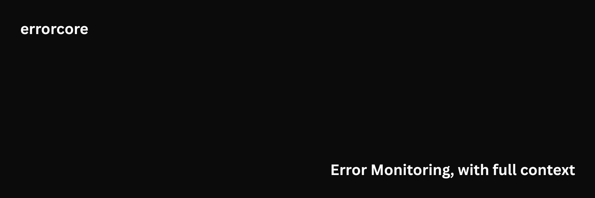

# Errorcore



Error monitoring with execution context for Node.js.

Errorcore captures the state around a failure so you can inspect what happened at the point an error was thrown. It focuses on request-level context, execution flow, and minimal setup.

## What it does

- Captures local variables and arguments at the point an error is thrown
- Tracks request context across async boundaries using AsyncLocalStorage
- Records outbound IO in sequence
- Attaches process and environment metadata with optional scrubbing
- Encrypts payloads before transport
- Buffers failed deliveries and retries when the network is available

## Getting started

1. Install the package

   ```bash
   npm install errorcore
   ```

2. Configure your collector endpoint

3. Initialize at the top of your application entry point

Errors are captured and sent to your collector.

## Documentation

- [SDK documentation](https://errorcore.dev/docs)
- [Configuration reference](SETUP.md)
- [CLI usage](SETUP.md#validation)
- [Operations guide](OPERATIONS.md)
- [Data structures](DB.md)

## Security

Report vulnerabilities via issues or privately.

## License

[MIT](LICENSE)
